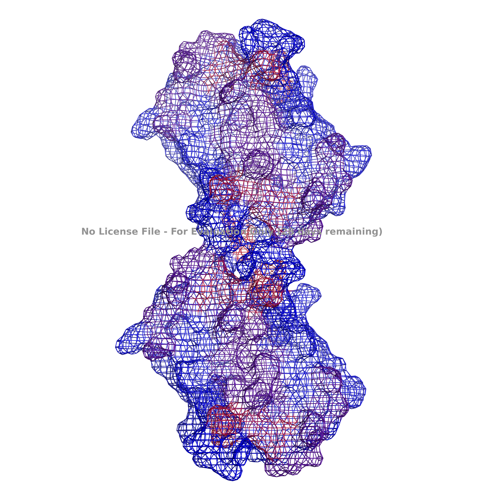

# Immune Epitope Database API Wrapper with PyMol Integration

 

## Background

Immunogenicity is the ability of a particular substance, such as an antigen or epitope, to provoke an immune response in the body of a human and other animal. In other words, immunogenicity is the ability to induce a humoral and/or cell-mediated immune responses.

Wanted immunogenicity is typically related with vaccines, where the injection of an antigen (the vaccine) provokes an immune response against the pathogen (virus, bacteria...) aiming at protecting the organism. Vaccine development is a complex multi-step process, immunogenicity being at the center of vaccine efficacy.

Unwanted immunogenicity is an immune response by an organism against a therapeutic antigen (ex. recombinant protein, or monoclonal antibody). This reaction leads to production of anti-drug-antibodies (ADAs) inactivating the therapeutic effects of the treatment and, in rare cases, inducing adverse effects. A challenge in biotherapy is predicting the immunogenic potential of novel protein therapeutics.

There are many databases that exist that contain hundreds of thousands of known T-Cell activating epitopes/antigens that - if present in your biologic - could illicit an unwanted immune response inside the body. Screening for these potentially immunogenic peptides (PIPs) is a huge aspect of creating novel therapeutics.

## Python Script

This script will iterate through a directory of fasta files and check them for potential immunogenicity by submitting a POST request to the IEDB's MHC-I epitope binding prediction algorithm that takes advantage of the Stabilized Matrix Method written by Peters and Sette.

It parses the response from the IEDB API and searches for PIP's that fall below a certain threshold value chosen by the user. This value is the cutoff point at which the user has decided an adverse immune response will occur.

## PyMol Integration (Image Sources)

Also included included in the repository is a PyMol extension that lets the script run inside of PyMol2. Load in any PDB structure, run the script, and call immuno_check from the PyMol command line. Once run, it will re-color the protein's structure to reflect regions that were flagged as potentially immunogenic.

